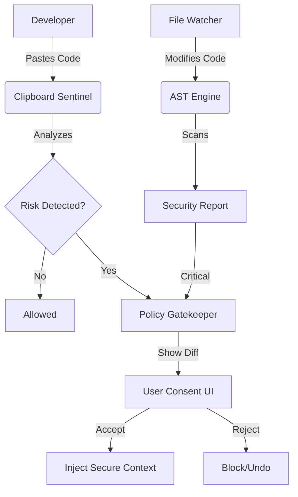

# 🛡️ Trepan - The DevSecOps Cortex

**Trepanning:** *(verb)* From Greek *trypanon* (borer). The surgical intervention of drilling a burr hole into the skull to expose the dura mater.

In the context of software security, **Trepan** performs a "deep inspection" of your codebase's brain—the logic and structure—exposing hidden vulnerabilities that surface-level regex scanners miss. It is a local-first security enforcer that prioritizes **Visible Trust** over silent automation.

## 📉 The Problem: AI Context Drift

In the era of **VibeCoding**—where AI generates code faster than humans can review—projects suffer from **Context Drift**. As you iterate rapidly with LLMs, original security constraints and architectural patterns often get "hallucinated away" or subtly rewritten.

Trepan exists to solve this. It acts as a hard anchor, ensuring that while your "vibe" evolves and code flows freely, your security posture remains rigid and uncompromised.

---

## 🧠 The Philosophy of Visible Trust

Traditional sec-tools often silently block or auto-fix code, leaving developers confused or frustrated. Trepan follows the **Law of Visible Trust**:

1.  **Transparency:** You see exactly what policy is being violated.
2.  **Consent:** No code is modified without your explicit approval via a Diff View.
3.  **Context:** Policies are injected as "Context" into your workflow, not just error messages.

---

## 🚀 Key Features

### Core Capabilities
- **🔍 AST Security Engine**: Structural code analysis using Python's `ast` module (no fragile regex).
- **🛡️ Semantic Firewall (Clipboard Sentinel)**: Analyzes copied code before it enters your editor.
- **🔗 Polyglot Taint Analysis**: Tracks data flow across Python, JavaScript, and TypeScript.
- **📦 Supply Chain Sentinel**: Detects typosquatting and vulnerable dependencies in `requirements.txt` & `package.json`.
- **🖥️ Hardware Sentinel**: Intelligent task routing (CPU vs. GPU) for optimal performance.
- **🤖 Shadow Red Teamer**: On-demand AI threat modeling (Llama-3-70b via Groq).

---

## 📖 Usage Guide

### 1. Installation

```bash
pip install -r requirements.txt
```

### 2. Quick Start (Passive Defense)

Start the Trepan guardian in your project root. It will watch for file changes and clipboard activity.

```bash
# Basic usage
python trepan.py

# Watch a specific directory
python trepan.py --watch /path/to/project
```

### 3. Active Interventions

Trepan intervenes in two main ways:

#### A. The Semantic Firewall (Clipboard)
When you copy code (e.g., from StackOverflow or ChatGPT), Trepan scans it.
- **If Safe:** It lets you paste.
- **If Risky:** It intercepts the paste and shows a **Policy Dialog**.
    - You see the *Original* vs. *Proposed* context.
    - You must click **ACCEPT** to inject the necessary security context or fixes.

#### B. The Red Team Trigger (On-Demand)
Use specific keywords in your code or clipboard to trigger an AI audit:
- `!audit`, `!attack`, `hack`, `exploit`, `vulnerability`

*Example:*
```python
# FIXME: Is this safe? !audit
user_input = request.args.get('cmd')
os.system(user_input)
```
*Trepan will detect `!audit`, launch a Red Team scan, and propose a fix.*

---

## 🔮 Future Purposes & Roadmap

Trepan is evolving from a simple linter into a **Self-Healing Security Cortex**. Based on the current codebase, the following phases are in development:

-   **Phase 5: Polyglot Expansion**
    -   Currently supports basic JS/TS taint analysis.
    -   *Goal:* Full AST support for Rust, Go, and Java.

-   **TR-01: Hardware Sentinel**
    -   *Current:* Basic CPU/GPU detection.
    -   *Goal:* Dynamic load balancing where heavy vector searches run on GPU and lightweight AST parsing runs on CPU.

-   **TR-02: Drift Engine**
    -   *Goal:* Semantic drift detection. Trepan will warn you if your code implementation is "drifting" away from its original architectural intent or safety constraints over time.

-   **Enterprise Edition**
    -   Centralized policy management for teams.
    -   "Fleet Learning" - if a vulnerability is found in one project, the fix is scrutinized and propagated (as a policy proposal) to other projects.

---

## 🏗️ Architecture



## 📁 Project Structure

| Module | Purpose |
|--------|---------|
| `trepan.py` | The Cortex (Main Orchestrator & Logic) |
| `policy_gatekeeper.py` | Enforces rules based on `GEMINI.md` |
| `clipboard_sentinel.py` | The Semantic Firewall (TR-03) |
| `taint_engine.py` | Polyglot data flow analysis (Phase 5) |
| `hardware_sentinel.py` | Compute resource router (TR-01) |
| `drift_engine.py` | Architecture drift detector (TR-02) |
| `red_team.py` | AI-driven threat modeling |

---

## 📜 The Trepan Constitution

1.  **Law of Visible Trust:** User consent must be explicit.
2.  **Law of Separation:** Logic lives in modules, not the orchestrator.
3.  **Law of Audit:** Every Red Team action must be logged.
4.  **Law of Stability:** No feature removal for "simplicity".

---

## 📄 License

MIT License
