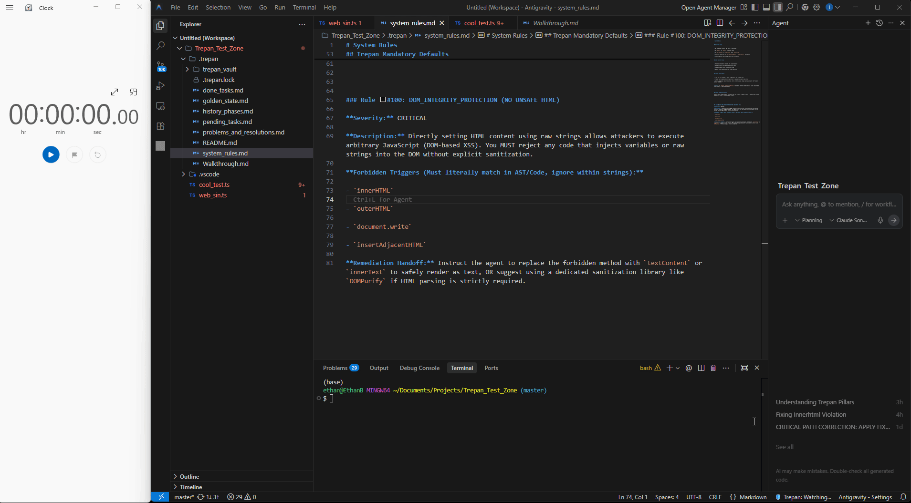

<div align="center">

# 🛡️ SemanticGuard

### The Architectural Seatbelt for AI-Assisted Coding

**Stop "Vibe Coding" from drifting into architectural debt.**

[](https://www.gnu.org/licenses/agpl-3.0)
[](https://code.visualstudio.com/)
[](https://github.com/dsadsadsadsadas/SemanticGuard)

</div>

---

## 🎯 What is SemanticGuard?

SemanticGuard is a VS Code extension that acts as a **mandatory enforcement layer** between your AI IDE and your codebase. While tools like Semgrep catch patterns, **SemanticGuard catches intent violations**.

Think of it as an architectural airbag that deploys before bad code hits your repository.

---

## 🎬 See SemanticGuard in Action (Local Mode)


---

## 🚨 The Problem: Context Drift

You ask an AI for "Feature A." It gives you "Feature A," but it also:

- ❌ Reintroduces a security vulnerability you fixed last week
- ❌ Ignores your architectural boundaries (e.g., puts DB logic in the View)
- ❌ Leaks PII into logs because "it seemed faster"

**Standard linters won't catch this** because the code is syntactically perfect.  
**SemanticGuard catches it** because the code is semantically wrong.

---

## ✨ Key Features

| Feature | Description |
|---------|-------------|
| 🧠 **Semantic Auditing** | Uses LLMs to verify code against your project's unique "Golden State" |
| 🔒 **Privacy-First** | Can Run 100% locally via Ollama (Llama 3.1/DeepSeek) by default |
| ⚡ **Power Mode** | Switch to Cloud (Groq/OpenRouter) for 3x faster audits (sub-1s) using your own API keys |
| 🛡️ **Intent Verification** | Catches hardcoded secrets, unsafe data flows, and "hallucinated" architecture |
| 📁 **The Vault** | A versioned `.SemanticGuard/` directory that stores your project's rules, history, and resolutions |

---

## 🚀 Quick Start (60 Seconds)

> **Note:** SemanticGuard repository is **lightweight** (~50MB). Models are downloaded separately only if you choose Local Mode.

### 1️⃣ Clone & Install

```bash
git clone https://github.com/dsadsadsadsadas/SemanticGuard
cd SemanticGuard
pip install -r requirements.txt
```

### 2️⃣ Choose Your Engine

**Local Mode (Privacy-First):**
```bash
# Install Ollama (one-time setup)
curl -fsSL https://ollama.com/install.sh | sh

### 3️⃣ Install Extension & Initialize

```bash
# Install VS Code extension
code --install-extension extension/SemanticGuard-gatekeeper-2.4.1.vsix  
```

**Power Mode (Cloud-Based):**
```bash
# Start server (no model download needed)
python start_server.py

# Then configure API key in VS Code extension
# Click ⚙️ Gear Icon → Configure API Key
```
### 3️⃣ Initialize

Click **"Initialize Project"** in the sidebar. Choose a persona:

- 🚀 **Solo-Indie**: Focuses on clean naming and small functions
- 🏗️ **Architect**: Enforces DI and interface-driven design
- 🛡️ **Fortress**: Strict security, input sanitization, and statelessness

---

## 🏛️ The "Six Pillars" Architecture

SemanticGuard isn't just a prompt; it's a **state machine**. It tracks your project via:

```
.SemanticGuard/
├── golden_state.md    # What is allowed (ONLY Allowed)
├── system_rules.md    # What is forbidden ( NEVER Allowed)
├── done_tasks.md      # Tasks that are done
├── pending_tasks.md   # Pending Tasks
├── problems_and_resolutions.md #Problems that occured and their Fix
├── Walkthrough.md #What Happend Throughout the Audit
└── 
```

---

## ⚖️ Performance & Privacy

| Feature | Local Mode | Power Mode ⚡ |
|---------|-----------|--------------|
| **Speed** | 4-6s / audit | 0.5s - 1.5s / audit |
---

## 📦 Repository Size

| Component | Size | Notes |
|-----------|------|-------|
| **Git Clone** | ~50MB | Code only - lightweight! |
| **Ollama Model** (optional) | ~4.7GB | Downloaded separately, not in repo |
| **Total for Local Mode** | ~50MB + 4.7GB | Model stored in `~/.ollama/`, not in Git |
| **Total for Power Mode** | ~50MB | No model download needed |

**Important:** Model files are NEVER included in the Git repository. They are downloaded on-demand when you choose Local Mode and stored in Ollama's directory.


---

## 📐 Architectural Integrity (Golden State)

Unlike traditional scanners that only hunt for bugs, SemanticGuard enforces your **Golden State**—the core architectural plan of your project. It detects **Context Drift** before it becomes technical debt.

### How It Works

1. **Instruction**: Place a `golden_state.md` in your `.SemanticGuard/` directory defining your "Must-Have" tools, frameworks, and patterns.

2. **Enforcement**: On every save, SemanticGuard audits the diff against your plan.

3. **The Result**: If your plan mandates FastAPI but the AI suggests Flask, SemanticGuard blocks the save and alerts you to the drift.

> **"Stop the loop. Guard the intent."**


---

## 🎮 Usage

### Basic Workflow

1. **Write code** in your AI IDE (Cursor, Windsurf, etc.)
2. **Save the file** (Ctrl+S / Cmd+S)
3. **SemanticGuard audits** the changes against your rules
4. **Accept or Reject** based on the drift score

### Drift Score Interpretation

- 🟢 **0.0 - 0.3**: Healthy (Auto-accept)
- 🟡 **0.3 - 0.6**: Warning (Review recommended)
- 🔴 **0.6 - 1.0**: Critical (Auto-reject)

---

## 🛠️ Configuration

### Local Mode Setup

```bash
# Install Ollama
curl -fsSL https://ollama.com/install.sh | sh

# Pull the model
ollama pull llama3.1:8b

# Start Ollama server
ollama serve
```

### Power Mode Setup

1. Open SemanticGuard sidebar
2. Click ⚙️ **Settings**
3. Select **"Configure API Key"**
4. Choose provider (Groq or OpenRouter)
5. Enter your API key

---

## 📚 Documentation

- [Architecture Overview](docs/ARCHITECTURE.md)
---

## 🤝 Get Involved

Built by **Ethan Baron**. If SemanticGuard caught a drift for you, let me know!

- 🐦 **X**: [@Jsaaaron91633](https://x.com/Jsaaaron91633)
- 💼 **LinkedIn**: [Ethan Baron](https://www.linkedin.com/in/ethan-baron-b77965374/)
- 📧 **Email**: ethan.baron.home@gmail.com

---

## 📄 License

**AGPLv3** — Keep it open.

This project is licensed under the GNU Affero General Public License v3.0. See [LICENSE](LICENSE) for details.

---

## 🌟 Star History

If SemanticGuard helped you catch a drift, give it a star! ⭐

---

<div align="center">

**Made with 🛡️ by developer, for developers**

[Report Bug](https://github.com/dsadsadsadsadas/SemanticGuard) 

</div>
