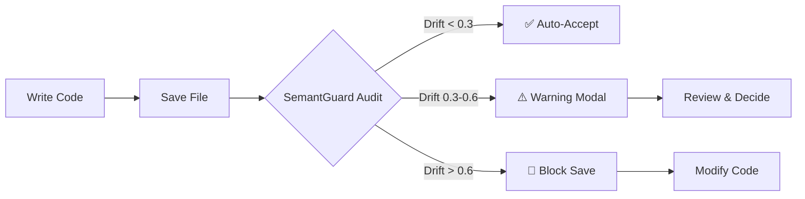

<div align="center">

# 🛡️ SemantGuard Gatekeeper

### VS Code Extension: The Architectural Seatbelt for AI-Assisted Coding

**Stop "Vibe Coding" from drifting into architectural debt.**

[](https://marketplace.visualstudio.com/items?itemName=trepansec.semantguard-gatekeeper)
[](https://code.visualstudio.com/)
[](https://www.gnu.org/licenses/agpl-3.0)

</div>

---

## 🎬 See SemantGuard in Action


---

## 🎯 What is SemantGuard?

SemantGuard is a VS Code extension that acts as a **mandatory enforcement layer** between your AI IDE and your codebase. 

While tools like Semgrep catch patterns, **SemantGuard catches intent violations**.

> Think of it as an architectural airbag that deploys before bad code hits your repository.

---

## 🚨 The Problem: Context Drift

You ask an AI for "Feature A." It gives you "Feature A," but it also:

```diff
- ❌ Reintroduces a security vulnerability you fixed last week
- ❌ Ignores your architectural boundaries (e.g., puts DB logic in the View)
- ❌ Leaks PII into logs because "it seemed faster"
```

**Standard linters won't catch this** because the code is syntactically perfect.  
**SemantGuard catches it** because the code is semantically wrong.

---

## ✨ Key Features

### 🧠 Semantic Auditing
Uses LLMs to verify code against your project's unique "Golden State"

### 🔒 Privacy-First
Runs 100% locally via Ollama (Llama 3.1/DeepSeek) by default

### ⚡ Power Mode
Switch to Cloud (Groq/OpenRouter) for 3x faster audits (sub-1s) using your own API keys

### 🛡️ Intent Verification
Catches hardcoded secrets, unsafe data flows, and "hallucinated" architecture

### 📁 The Vault
A versioned `.semantguard/` directory that stores your project's rules, history, and resolutions

---

## 🚀 Quick Start (60 Seconds)

### 1️⃣ Install the Extension

**From VS Code Marketplace:**
```
Search for "SemantGuard Gatekeeper" in VS Code Extensions
```

**Or install manually:**
```bash
code --install-extension semantguard-gatekeeper-2.3.8.vsix
```

### 2️⃣ Choose Your Engine

<table>
<tr>
<td width="50%">

#### 🏠 Local Mode (Private)

```bash
# Install Ollama
curl -fsSL https://ollama.com/install.sh | sh

# Pull the model
ollama pull llama3.1:8b

# Start server
ollama serve
```

**Best for:**
- Enterprise environments
- Sensitive codebases
- Offline development

</td>
<td width="50%">

#### ⚡ Power Mode (Fast)

1. Click ⚙️ **Gear Icon** in sidebar
2. Select **"Configure API Key"**
3. Choose provider:
   - Groq (fastest)
   - OpenRouter (most models)
4. Enter your API key

**Best for:**
- Rapid prototyping
- Personal projects
- Speed-critical workflows

</td>
</tr>
</table>

### 3️⃣ Initialize Your Project

Click **"Initialize Project"** in the SemantGuard sidebar and choose a persona:

| Persona | Focus | Best For |
|---------|-------|----------|
| 🚀 **Solo-Indie** | Clean naming, small functions | Solo developers, startups |
| 🏗️ **Architect** | DI, interface-driven design | Enterprise teams |
| 🛡️ **Fortress** | Security, input sanitization | Security-critical apps |

---

## 🏛️ The "Six Pillars" Architecture

SemantGuard isn't just a prompt; it's a **state machine** that tracks your project:

```
.semantguard/
├── 📜 golden_state.md    # What is allowed
├── 🚫 system_rules.md    # What is forbidden
├── 📋 task_logs.md       # Pending and completed work
├── 🔍 resolutions.md     # Memory of past bugs
├── 📊 audit_history.json # Historical drift scores
└── 🔒 .semantguard.lock  # Vault signature
```

---

## ⚖️ Performance & Privacy

| Feature | Local Mode 🏠 | Power Mode ⚡ |
|---------|--------------|--------------|
| **Speed** | 4-6s / audit | 0.5-1.5s / audit |
| **Privacy** | 100% Offline | API-based |
| **Cost** | Free | ~$0.001 / audit |
| **Best For** | Enterprise / Sensitive | Prototyping / Speed |
| **Models** | Llama 3.1, DeepSeek | Llama 4 Scout, Claude 3.5 |

---

## 📐 How It Works: Architectural Integrity

Unlike traditional scanners that only hunt for bugs, SemantGuard enforces your **Golden State**—the core architectural plan of your project.

### The Workflow



### Drift Score Interpretation

- 🟢 **0.0 - 0.3**: Healthy (Auto-accept)
- 🟡 **0.3 - 0.6**: Warning (Review recommended)
- 🔴 **0.6 - 1.0**: Critical (Auto-reject)

### Example: Catching Intent Drift

**Your Golden State says:**
```markdown
## Backend Framework
- **Required**: FastAPI
- **Forbidden**: Flask, Django
```

**AI suggests:**
```python
from flask import Flask  # ❌ Drift detected!
app = Flask(__name__)
```

**SemantGuard blocks the save:**
```
🚨 Context Drift Detected (Score: 0.85)

Violation: Flask usage detected
Golden State mandates: FastAPI only
Recommendation: Rewrite using FastAPI
```

> **"Stop the loop. Guard the intent."**

---

## 🎮 Usage Guide

### Basic Commands

| Command | Description |
|---------|-------------|
| `SemantGuard: Initialize Project` | Set up `.semantguard/` vault |
| `SemantGuard: Toggle Airbag On/Off` | Enable/disable enforcement |
| `SemantGuard: Show Server Status` | Check connection to inference server |
| `SemantGuard: Configure Power Mode` | Set up API keys |
| `SemantGuard: Audit Entire Folder` | Run full workspace audit |

### Keyboard Shortcuts

- `Ctrl+Shift+G` (Windows/Linux) or `Cmd+Shift+G` (Mac): Toggle SemantGuard
- `Ctrl+Shift+A` (Windows/Linux) or `Cmd+Shift+A` (Mac): Ask SemantGuard

---

## 🛠️ Configuration

### Extension Settings

```json
{
  "semantguard.enabled": true,
  "semantguard.serverUrl": "http://127.0.0.1:8001",
  "semantguard.timeoutMs": 300000,
  "semantguard.enforcementMode": "Soft",
  "semantguard.processor_mode": "GPU",
  "semantguard.excludePatterns": [
    "**/node_modules/**",
    "**/.git/**",
    "**/*.md",
    "**/*.json"
  ]
}
```

### Enforcement Modes

- **Soft**: Allows saves on network timeout (fail-open)
- **Strict**: Blocks saves on network timeout (fail-closed)

---

## 📊 Sidebar Features

### Vault Access Panel

- **Real-time drift monitoring**
- **Audit history visualization**
- **Quick access to pillar files**
- **Model selection dropdown**
- **Settings gear for configuration**

### Drift Meter

Visual representation of your code's alignment with the Golden State:

```
Drift Score: 0.15 🟢 HEALTHY
━━━━━━━━━━━━━━━━━━━━━━━━━━━━━━━━━━━━━━━━
```

---

## 🔧 Troubleshooting

### Common Issues

**Extension not activating?**
```bash
# Check if server is running
curl http://127.0.0.1:8001/health

# Restart Ollama
ollama serve
```

**Slow audits?**
- Switch to Power Mode with Groq
- Use GPU acceleration (Settings → Toggle CPU/GPU)
- Reduce context window in `system_rules.md`

**False positives?**
- Refine your `golden_state.md`
- Add exceptions to `system_rules.md`
- Use "Update Rules" button in rejection modal

---

## 🤝 Contributing

We welcome contributions! See [CONTRIBUTING.md](../CONTRIBUTING.md) for guidelines.

---

## 📄 License

**AGPLv3** — Keep it open.

This extension is licensed under the GNU Affero General Public License v3.0.

---

## 🌟 Support

Built by **Ethan Baron**. If SemantGuard caught a drift for you, let me know!

- 🐦 **X**: [@Jsaaaron91633](https://x.com/Jsaaaron91633)
- 💼 **LinkedIn**: [Ethan Baron](https://linkedin.com/in/ethan-baron)
- 🐛 **Issues**: [GitHub Issues](https://github.com/yourusername/semantguard/issues)

---

<div align="center">

**Made with 🛡️ by developers, for developers**

[⭐ Star on GitHub](https://github.com/yourusername/semantguard) · [📖 Documentation](https://semantguard.dev) · [💬 Discord](https://discord.gg/semantguard)

</div>